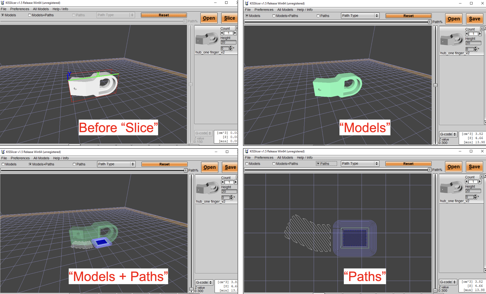

# G-code Generation
## Download Slicer
- Download and unzip [3D printer_3DP CX300.zip](https://github.com/HKPolyU-UAV/3d_printing/blob/main/3D%20printer_3DP%20CX300.zip) to get the slicing GUI.\
- Go to `3D printer_3DP CX300` > `software` > `Kisslicer1.5-3.10` > `KISSlicer.exe` or `KISSlicer64.exe`

## Check parameter settings on KISSlicer
1. Set `Settings Level` to `expert`.

      

   
2. Set parameters in `Style`:
   - Choose `Style Name`: `0.3`/`0.2`/`0.1` (Higher number: higher layer thickness and coarse but less printing time). It's recommended to set `0.3` for prototype.
   - Set `Infill`. It's recommended to set `20%` for prototype.
   - Set `Infill Style`. It's recommended to set `Rounded` for prototype.
     
   

      
   

   
 3. Set parameters in `Support`:
    - Always set `Support Name` to `sample support` if you want to get the auto support generation.
    - Choose `Support: Coarse`.
    - Set `Raft Type` to `Off`. It's recommended to use `brim` instead of `raft` for easier removal.
    - Set `Support Z-Roof [mm]` to 400. If your model height is less than the `Support Z-Roof [mm]`, KISSlicer will only generate support up to the value of `Support Z-Roof [mm]` in the z-axis.
    
   

      
   

   
4. Set parameters in `Ext Map`:

   

      
   

   
5. Set parameters in `Printer`:
   
   

      
   

6. Load STL file(s) into KISSlicer and do slicing
   

      
   

7. Model rotation
   

       
   

8. Check printing time and adjust location of model
   

      
   

