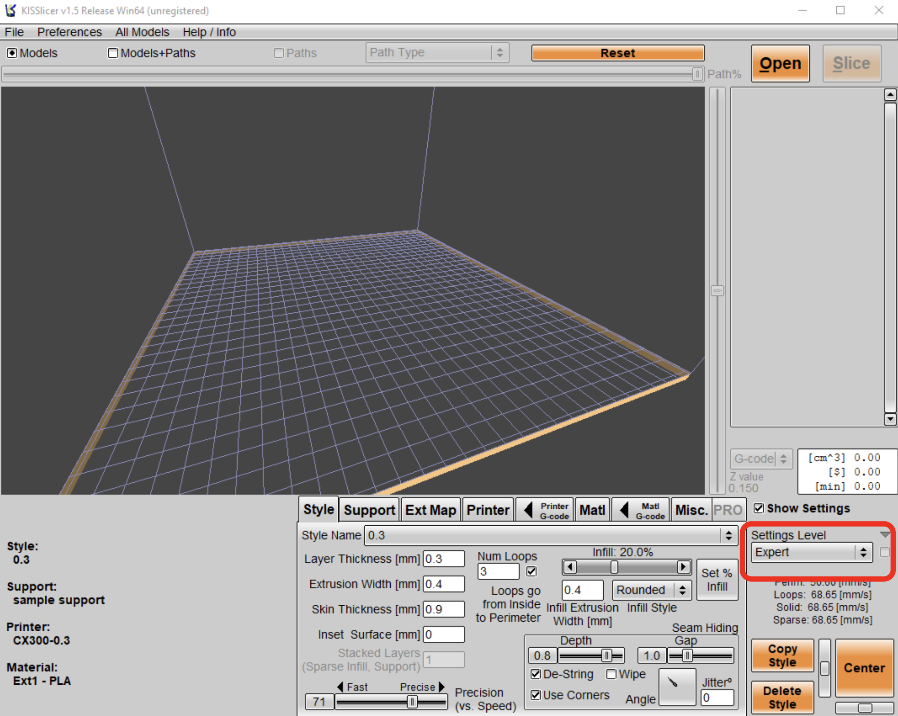
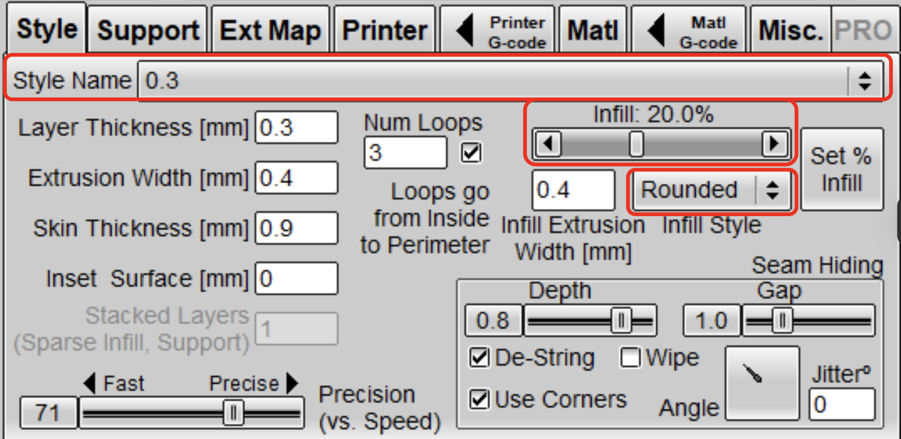
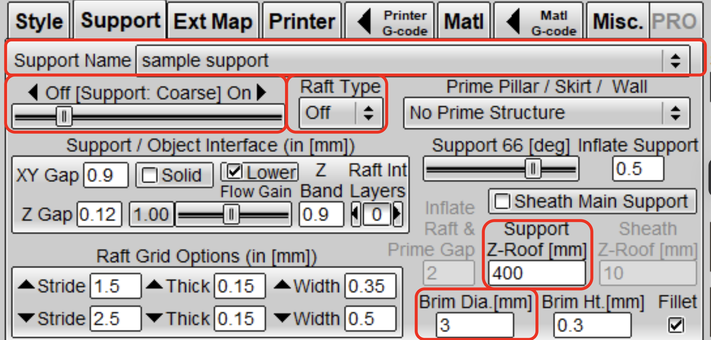
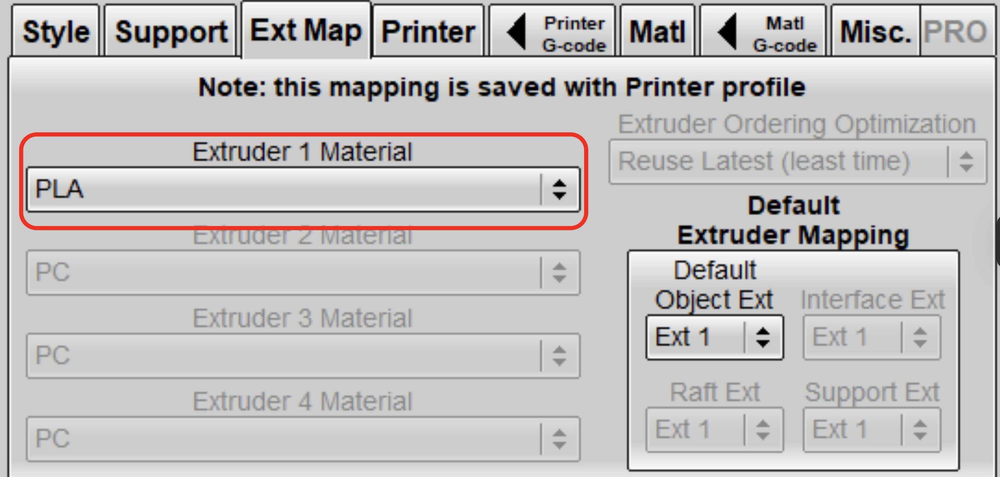
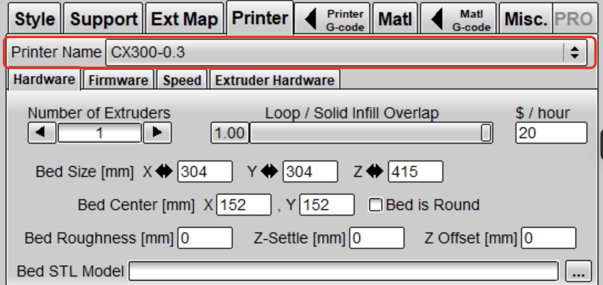
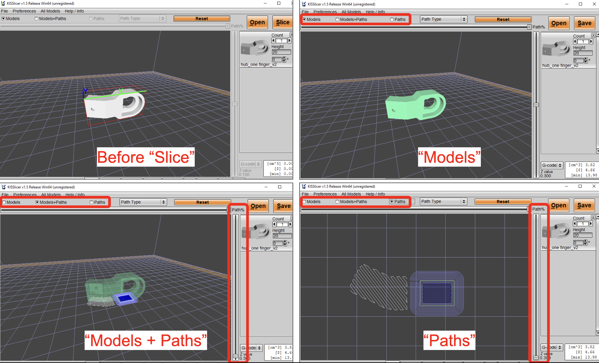
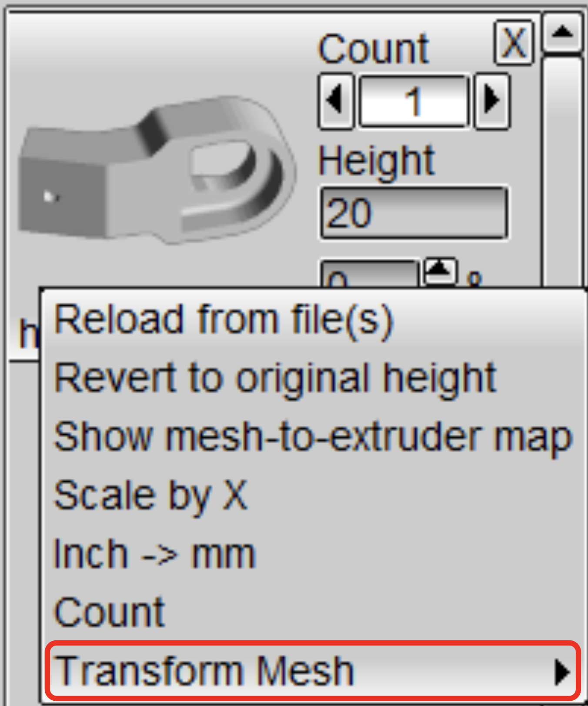
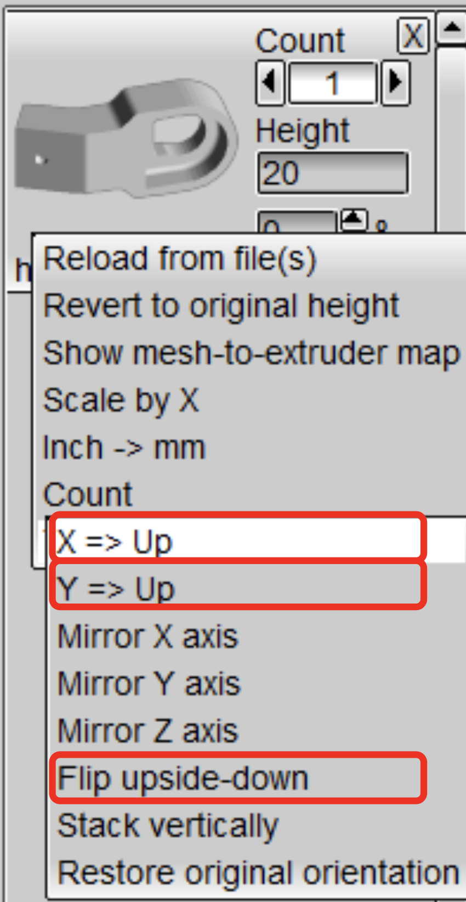
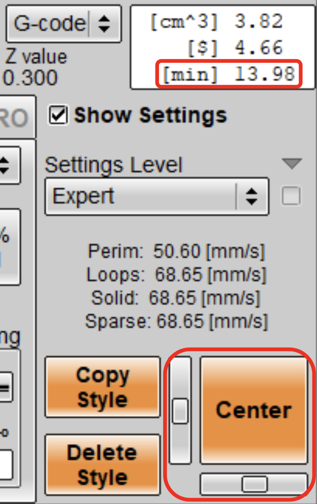

# G-code Generation
## Download Slicer
- Download and unzip [3D printer_3DP CX300.zip](https://github.com/HKPolyU-UAV/3d_printing/blob/main/3D%20printer_3DP%20CX300.zip) to obtain the slicing GUI.
- Go to `3D printer_3DP CX300` > `software` > `Kisslicer1.5-3.10`, then run either `KISSlicer.exe` or `KISSlicer64.exe`.

## Check parameter settings on KISSlicer
1. Set `Settings Level` to `Expert`.

      

   
2. Set parameters in `Style`:
   - Choose `Style Name`: `0.3`/`0.2`/`0.1` *(Higher number indicates greater layer thickness, resulting in a coarser print but shorter printing time)*. It's recommended to set it to `0.3` for prototypes.
   - Set `Infill`. A value of `20%` is recommended for prototypes.
   - Set `Infill Style`. It's recommended to use `Rounded` for prototypes.
     
   

      
   

   
 3. Set parameters in `Support`:
    - Always set `Support Name` to `sample support` if you want to use auto support generation.
    - Choose `Support: Coarse`.
    - Set `Raft Type` to `Off`. It's recommended to use `brim` instead of `raft` for easier removal.
    - Set `Support Z-Roof [mm]` to 400. Note that if your model's height is less than the `Support Z-Roof [mm]`, KISSlicer will only generate support up to this value on the z-axis.
    - Set `Brim Dia. [mm]` to `3` for normal cases. Increase this value if your model is large.
      
   

      
   

   
4. Set parameters in `Ext Map`:
   - Select the correct filament type under `Extruder 1 Material`. Usually, we use `PLA` or `TPU`.

   

      
   

   
5. Set parameters in `Printer`:
   - Set the value of `Printer Name` to be the same as `Style Name`.
   
   

      
   

6. Load STL file(s) into KISSlicer and do slicing
   - Press `Open` and select your desired STL file.
   - Press `Slice` to do slicing.
   - Select `Models`, `Models + Paths` or `Paths` (in the top left corner) to view the slicing result.
   - Drag the bar on the right to check the layers of the sliced model in `Models + Paths` or `Paths` mode.
   
   

      
   

8. Model rotation
   - Right-click in the top right corner and select `Transform Mesh`.
   - Press `X => Up`, `Y => Up` or `Flip upside-down` to rotate the model along the x, y or z-axis.
   - Be careful to use `Mirror X/Y/Z axis`. Ensure that your model can be mirrored before using this function.
   
   

       
   

10. Check printing time and adjust location of model
   

      
   

